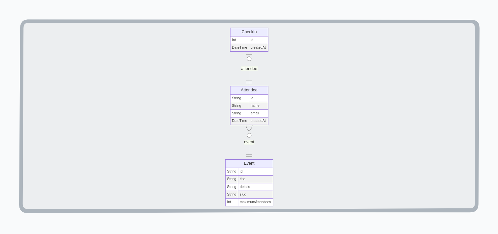

<a name="passin_nlw_unite_python"></a>

[![Contributors][contributors-shield]][contributors-url]
[![Forks][forks-shield]][forks-url]
[![Stargazers][stars-shield]][stars-url]
[![Issues][issues-shield]][issues-url]
[![nlw][nlw-shield]][nlw-url]
[![LinkedIn][linkedin-shield]][linkedin-url]


<!-- PROJECT LOGO -->
<br />
<div align="center">

  <h3 align="center">Check.in</h3>

  <p align="center">
    BackEnd project application built in Python and Flask during the NLW 15 by Rocktseat.
    <br />
    <a href="https://github.com/luk3mn/passin_nlw_unite_python/README.md"><strong>Explore the docs »</strong></a>
    <br />
    <br />
  </p>
</div>


<!-- TABLE OF CONTENTS -->
<details>
  <summary>Table of Contents</summary>
  <ol>
    <li>
      <a href="#about-the-project">About The Project</a>
      <ul>
        <li><a href="#built-with">Built With</a></li>
      </ul>
    </li>
    <li>
      <a href="#getting-started">Getting Started</a>
      <ul>
        <li><a href="#prerequisites">Prerequisites</a></li>
        <li><a href="#installation">Installation</a></li>
      </ul>
    </li>
    <li><a href="#usage">Usage</a></li>
    <!-- <li><a href="#deploy">Deploy</a></li> -->
    <li><a href="#roadmap">Roadmap</a></li>
    <li><a href="#license">License</a></li>
    <li><a href="#authors">Authors</a></li>
    <li><a href="#feedback">Feedback</a></li>
    <li><a href="#acknowledgments">Acknowledgments</a></li>
  </ol>
</details>


<!-- ABOUT THE PROJECT -->
## About The Project


> The pass.in is an application about **Events ateendees management**.
- The app allows the organizer to register for an event and open a public registration page.
- Registered participants can issue a credential for check-in on the day of the event.
- The system will scan the participant's credentials to allow entry to the event.

### Requirements

- The organizer must be able to register a new event;
- The organizer must be able to view event data;
- The organizer must be able to view a list of attendees

- The attendees must be able to register themself in an event;
- The attendees must be able to view the event badge;
- The attendees must be able to make the check-in at the event;

### Business rules

- The attendees just can register once for an event.
- The attendees just can register for an event that isn't full;
- The attendees just can make the check-in for an event once;

### Nonfunctional requirements

- The check-in for the event will be accomplished through QRCode;

<p align="justify">
  In this project, we can find subjects such as: 

  - **Python;** 
  - **Flask;** 
  - **SQLAlchemy;** 
  - **Rest API;**
</p> 

<p align="right">(<a href="#passin_nlw_unite_python">back to top</a>)</p>


### Built With

Write here

* [![Python][Python]][Python-url]
* [![Flask][Flask]][Flask-url]

<p align="right">(<a href="#passin_nlw_unite_python">back to top</a>)</p>


<!-- GETTING STARTED -->
## Getting Started

Here are some important topics about this project and how to replay it.

### Prerequisites

* virtualenv
  ```sh
  python3 -m venv .venv
  ```

### Installation

_Before starting this application in your local environment, it'll be necessary to proceed with some tasks to reproduce this project._

1. Clone the repo
   ```sh
   git clone https://github.com/luk3mn/passin_nlw_unite_python.git
   ```
2. Install packages
   ```sh
   pip freeze -r requirements.txt
   ```

<p align="right">(<a href="#passin_nlw_unite_python">back to top</a>)</p>


<!-- USAGE EXAMPLES -->
<!-- ## Usage -->

<!-- Deploy -->
<!-- ## Deploy -->


<!-- ROADMAP -->
## Roadmap

- [x] Init project
- [x] Creating and configuring database
- [x] Implementing **Event** entity and repository
- [x] Implementing **Attendee** entity and repository
- [x] Implementing **CheckIns** entity and repository
- [x] Implementing Flask environment
- [ ] Creating POST and GET endpoint to Event and Attendee
  - [ ] GET /events/{eventId}/attendees
  - [ ] GET /events/{eventId}
  - [ ] POST /events
- [ ] Exceptions handling
- [ ] Adding new features to AttendeeService
- [ ] adding new endpoints
  - [ ] POST /events/{eventId}/attendees
  - [ ] GET /attendees/{attendeeId}/badge
  - [ ] POST /attendees/{attendeeId}/check-in
- [ ] CheckInService
- [ ] Exception Handler


<p align="right">(<a href="#passin_nlw_unite_python">back to top</a>)</p>


<!-- LICENSE -->
## License

Distributed under the MIT License. See `LICENSE.txt` for more information.

<p align="right">(<a href="#passin_nlw_unite_python">back to top</a>)</p>


## Authors

- username: [@luk3mn](https://www.github.com/luk3mn)

## Feedback

If you have any feedback, please reach out to us at lucasnunes2030@gmail.com

> Project Link: [https://github.com/luk3mn/passin_nlw_unite_python](https://github.com/luk3mn/passin_nlw_unite_python)

<p align="right">(<a href="#passin_nlw_unite_python">back to top</a>)</p>


<!-- ACKNOWLEDGMENTS -->
## Acknowledgments

* [Rocketseat](https://www.rocketseat.com.br/)


<p align="right">(<a href="#passin_nlw_unite_python">back to top</a>)</p>


<!-- MARKDOWN LINKS & IMAGES -->
<!-- https://www.markdownguide.org/basic-syntax/#reference-style-links -->
[contributors-shield]: https://img.shields.io/github/contributors/luk3mn/passin_nlw_unite_python.svg?style=for-the-badge
[contributors-url]: https://github.com/luk3mn/passin_nlw_unite_python/graphs/contributors
[issues-shield]: https://img.shields.io/github/issues/luk3mn/passin_nlw_unite_python.svg?style=for-the-badge
[issues-url]: https://github.com/luk3mn/passin_nlw_unite_python/issues
[forks-shield]: https://img.shields.io/github/forks/luk3mn/passin_nlw_unite_python.svg?style=for-the-badge
[forks-url]: https://github.com/luk3mn/passin_nlw_unite_python/network/members
[stars-shield]: https://img.shields.io/github/stars/luk3mn/passin_nlw_unite_python.svg?style=for-the-badge
[stars-url]: https://github.com/luk3mn/passin_nlw_unite_python/stargazers
[license-shield]: https://img.shields.io/github/license/othneildrew/Best-README-Template.svg?style=for-the-badge
[license-url]: https://github.com/luk3mn/passin_nlw_unite_python/blob/master/LICENSE
[linkedin-shield]: https://img.shields.io/badge/-LinkedIn-black.svg?style=for-the-badge&logo=linkedin&colorB=555
[linkedin-url]: https://www.linkedin.com/in/lucasmaues/
[nlw-shield]: https://img.shields.io/static/v1?label=NLW&message=15&color=8257E5&style=for-the-badge&colorB=555
[nlw-url]: https://www.rocketseat.com.br/

<!-- Stack Shields -->
[Python]: https://img.shields.io/badge/Python-3776AB?style=for-the-badge&logo=python&logoColor=ffffff
[Python-url]: https://www.python.org/
[Flask]: https://img.shields.io/badge/Flask-000000?style=for-the-badge&logo=flask&logoColor=ffffff
[Flask-url]: https://flask.palletsprojects.com/en/3.0.x/